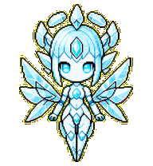

<div align="center">

# ✨ Codex Pets

**Small companions. Serious sprites.**

Custom animated pets for the Codex desktop app, packaged with one-click install links and reviewable validation evidence.




### Bella

*The 1 True Source — calm, crystalline, and quietly obsessed with coherence.*

[**Install Bella**](https://senyo888.github.io/codex-pets/install/bella/) · [Meet Bella](pets/bella/README.md) · [View the sprite QA](pets/bella/qa/contact-sheet.png)

</div>

## The collection

| Pet | Personality | Format | Status |
| --- | --- | --- | --- |
| [**Bella**](pets/bella/README.md) | A crystalline guardian of clarity, truth, and deterministic coherence. | Codex sprite v2 | Validated and ready |

More small beings will arrive when they are properly hatched, tested, and house-trained.

## Install a pet

The HTTPS install page opens the Codex pet installation flow when Pets are enabled for your account. It also keeps a visible fallback button because GitHub intentionally removes custom `codex://` links from rendered README files.

```text
codex://pets/install?name=Bella&imageUrl=https%3A%2F%2Fraw.githubusercontent.com%2Fsenyo888%2Fcodex-pets%2Fmain%2Fpets%2Fbella%2Fspritesheet.webp&description=The%201%20True%20Source%2C%20a%20calm%20crystalline%20harmonic%20source%20engine%20that%20restores%20deterministic%20coherence.&spriteVersionNumber=2
```

After installation, open **Settings → Pets**, choose Bella, and wake her with `/pet`.

### Manual installation

If the deep link is unavailable, place both package files in your local Codex pet directory:

```bash
mkdir -p "${CODEX_HOME:-$HOME/.codex}/pets/bella"
curl -fL https://raw.githubusercontent.com/senyo888/codex-pets/main/pets/bella/pet.json \
  -o "${CODEX_HOME:-$HOME/.codex}/pets/bella/pet.json"
curl -fL https://raw.githubusercontent.com/senyo888/codex-pets/main/pets/bella/spritesheet.webp \
  -o "${CODEX_HOME:-$HOME/.codex}/pets/bella/spritesheet.webp"
```

Refresh **Settings → Pets** after copying the files.

## Quality bar

Every published pet must include:

- a transparent, structurally valid Codex sprite atlas;
- matching metadata with an explicit sprite version;
- a human-readable preview;
- deterministic validation with no structural errors;
- visual review of every standard animation state;
- direction and continuity review for v2 pets.

Bella ships as an exact `1536 × 2288` v2 WebP atlas. Her published spritesheet matches the fully reviewed local package byte-for-byte. See her [validation summary](pets/bella/qa/validation-summary.json) and [contact sheet](pets/bella/qa/contact-sheet.png).

## Repository layout

```text
codex-pets/
├── catalog.json
├── pets/
│   └── bella/
│       ├── pet.json
│       ├── spritesheet.webp
│       ├── preview.gif
│       ├── README.md
│       └── qa/
└── CONTRIBUTING.md
```

## Compatibility

- **Codex desktop app:** v2 package with the full floating-pet animation and look-direction contract.
- **Codex CLI:** compatible terminals can select locally installed custom pets with `/pets`.
- **ChatGPT web:** custom uploads currently use a separate v1 upload contract, so this v2 package is intended for desktop and compatible CLI use.

See the official [Pets documentation](https://learn.chatgpt.com/docs/pets?surface=app) for current platform availability and controls.

## Contributing

New pets are welcome once they meet the same packaging and QA bar. Read [CONTRIBUTING.md](CONTRIBUTING.md) before opening a pull request.

## License

The pet artwork, animations, previews, and repository documentation are available under the [Creative Commons Attribution 4.0 International License](LICENSE).

Credit: **Senyo** · Source: `senyo888/codex-pets`
