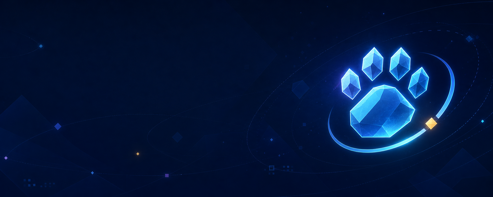

<div align="center">



# Codex Pets

**Small companions. Serious sprites.**

An independent community catalogue of custom animated pets for the Codex desktop app, packaged with one-click install links and reviewable validation evidence.


<a href="pets/bella/README.md"></a>
<a href="pets/aetherwing/README.md"></a>
<a href="pets/aethercore/README.md"></a>
<a href="pets/aethermite/README.md"></a>
<a href="pets/aetherbite/README.md"></a>
<a href="pets/calian/README.md"></a>
<a href="pets/scarlet/README.md"></a>

## [Bella](pets/bella/README.md) · [AetherWing](pets/aetherwing/README.md) · [AetherCore](pets/aethercore/README.md) · [AetherMite](pets/aethermite/README.md) · [Aetherbite](pets/aetherbite/README.md) · [Calian](pets/calian/README.md) · [Scarlet](pets/scarlet/README.md)

*7 distinct companions, each shipped as a transparent and inspectable v2 package.*

[**Browse the catalogue**](https://senyo888.github.io/codex-pets/) · [**Add your pet**](CONTRIBUTING.md#add-your-pet)

</div>

> [!IMPORTANT]
> This is an independent community project. It is not affiliated with or endorsed by OpenAI.

## The collection

| No. | Pet | Personality | Format | Status |
| --- | --- | --- | --- | --- |
| 001 | [**Bella**](pets/bella/README.md) | The 1 True Source, modernized with layered couture armour, six-wing depth, graceful glides, and a curtsy jump. | Sprite v2 | Validated and ready |
| 002 | [**AetherWing**](pets/aetherwing/README.md) | A premium dimensional guardian with metallic armour, glass optics, and truth-backed runtime discipline. | Sprite v2 | Validated and ready |
| 003 | [**AetherCore**](pets/aethercore/README.md) | The polished Continuity Engine: sapphire-eyed, halo-guided, and driven by a visible clockwork core. | Sprite v2 | Validated and ready |
| 004 | [**AetherMite**](pets/aethermite/README.md) | A dimensional bio-digital champion with a layered metallic shell, luminous glass optics, and an environmental core. | Sprite v2 | Validated and ready |
| 005 | [**Aetherbite**](pets/aetherbite/README.md) | Humidity Intelligence's layered bio-mechanical tinkerer, with crystalline wing depth and expressive articulated motion. | Sprite v2 | Validated and ready |
| 006 | [**Calian**](pets/calian/README.md) | Calian isolates decisive faults and restores deliberate control with calm, methodical judgement. | Sprite v2 | Validated and ready |
| 007 | [**Scarlet**](pets/scarlet/README.md) | Scarlet pairs vigilant drift tracing with propulsive follow-through, carrying every correction to verified closure beside Calian. | Sprite v2 | Validated and ready |

Each companion has a distinct identity and animation language. Every animated preview above is rendered directly from its current validated atlas.

### Calian and Scarlet — the sister act

Calian and Scarlet form a sister act of unmatched diligence: Calian isolates decisive faults and restores deliberate control; Scarlet carries every correction through to verified closure.

## Install a pet

Each HTTPS install page opens the pet installation flow when Pets are enabled for your account. It also provides direct package downloads as a fallback because GitHub removes custom `codex://` links from rendered README files.

| Pet | ID | Installer | README |
| --- | --- | --- | --- |
| Bella | `bella` | [Open installer](https://senyo888.github.io/codex-pets/install/bella/) | [Read README](pets/bella/README.md) |
| AetherWing | `aetherwing` | [Open installer](https://senyo888.github.io/codex-pets/install/aetherwing/) | [Read README](pets/aetherwing/README.md) |
| AetherCore | `aethercore` | [Open installer](https://senyo888.github.io/codex-pets/install/aethercore/) | [Read README](pets/aethercore/README.md) |
| AetherMite | `aethermite` | [Open installer](https://senyo888.github.io/codex-pets/install/aethermite/) | [Read README](pets/aethermite/README.md) |
| Aetherbite | `aetherbite` | [Open installer](https://senyo888.github.io/codex-pets/install/aetherbite/) | [Read README](pets/aetherbite/README.md) |
| Calian | `calian` | [Open installer](https://senyo888.github.io/codex-pets/install/calian/) | [Read README](pets/calian/README.md) |
| Scarlet | `scarlet` | [Open installer](https://senyo888.github.io/codex-pets/install/scarlet/) | [Read README](pets/scarlet/README.md) |

After installation, open **Settings → Pets**, choose your companion, and wake it with `/pet`.

### Manual installation

If the deep link is unavailable, place both package files in your local pet directory:

```bash
PET_ID=aetherwing # choose an ID from the table above
mkdir -p "${CODEX_HOME:-$HOME/.codex}/pets/$PET_ID"
curl -fL "https://raw.githubusercontent.com/senyo888/codex-pets/main/pets/$PET_ID/pet.json" \
  -o "${CODEX_HOME:-$HOME/.codex}/pets/$PET_ID/pet.json"
curl -fL "https://raw.githubusercontent.com/senyo888/codex-pets/main/pets/$PET_ID/spritesheet.webp" \
  -o "${CODEX_HOME:-$HOME/.codex}/pets/$PET_ID/spritesheet.webp"
```

Refresh **Settings → Pets** after copying the files.

## Quality bar

Every published pet includes:

- a transparent, structurally valid v2 sprite atlas;
- matching metadata with an explicit sprite version;
- a human-readable animated preview;
- deterministic validation with no structural errors;
- visual review of all standard animation states;
- direction and continuity review;
- public QA sheets and a sanitized validation summary.

All 7 published pets ship as exact `1536 × 2288` RGBA WebP atlases. Their published spritesheets match their fully reviewed local packages byte-for-byte.

| Pet | SHA-256 | Validation |
| --- | --- | --- |
| Bella | `548cb72d381fcc861f5017f0213c3d794ce2210d4b9781a58ee53331aa43344d` | [Summary](pets/bella/qa/validation-summary.json) |
| AetherWing | `c5b03756e270516b8200b75cef811e094f768638633273eadc3ce0c6fa5002fa` | [Summary](pets/aetherwing/qa/validation-summary.json) |
| AetherCore | `5ad38c56af287375f32e3706f119720a6c9122e8b5490a7fd7d6e07b05fc44dd` | [Summary](pets/aethercore/qa/validation-summary.json) |
| AetherMite | `13869434db6f58f07c0d2571def9d8da624bc77416adc4964727084d23840384` | [Summary](pets/aethermite/qa/validation-summary.json) |
| Aetherbite | `18ce2adf6e4b30c42b1943cd32398757014d26c729b7f3a63e4d969abed40346` | [Summary](pets/aetherbite/qa/validation-summary.json) |
| Calian | `4b9ac6125a4222a5e2391ba04ee3bf0a0b6c2fcd98aa07c8f2b2322dd614933b` | [Summary](pets/calian/qa/validation-summary.json) |
| Scarlet | `f94405dc13396f703b600f4462342d5928ec7716461c86ad96551fec63b54840` | [Summary](pets/scarlet/qa/validation-summary.json) |

## Repository layout

```text
codex-pets/
├── catalog.json
├── docs/
│   └── CATALOG_CONTRACT.md
├── pets/
│   └── <pet-id>/
│       ├── pet.json
│       ├── spritesheet.webp
│       ├── preview.gif
│       ├── README.md
│       └── qa/
├── site/
│   ├── assets/brand/
│   └── install/<pet-id>/
└── CONTRIBUTING.md
```

## Compatibility

- **Codex desktop app:** v2 packages with the full floating-pet animation and look-direction contract.
- **Codex CLI:** compatible terminals can select locally installed custom pets with `/pets`.
- **ChatGPT web:** custom uploads use a separate upload contract, so these packages target desktop and compatible CLI use.

See the [Pets documentation](https://learn.chatgpt.com/docs/pets?surface=app) for current platform availability and controls.

## Contributing

New pets are welcome. [Start a guided submission](https://github.com/senyo888/codex-pets/issues/new?template=add-your-pet.yml) with an idea or partial package, or follow the [Add Your Pet guide](CONTRIBUTING.md#add-your-pet) and [catalogue contract](docs/CATALOG_CONTRACT.md) when a complete package is ready for a pull request.

## License

The pet artwork, animations, previews, and repository documentation are available under the [Creative Commons Attribution 4.0 International License](LICENSE).

Credit: **Senyo** · Source: `senyo888/codex-pets`
