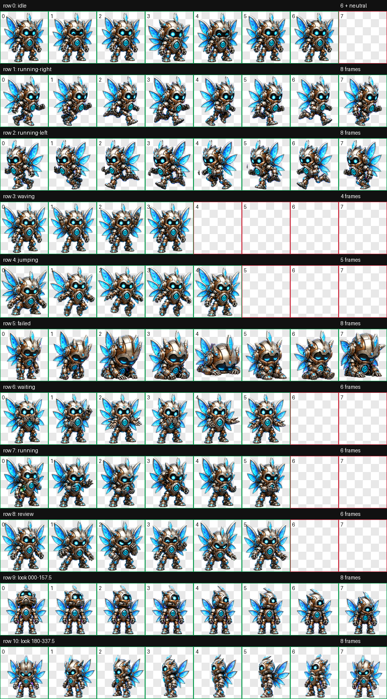
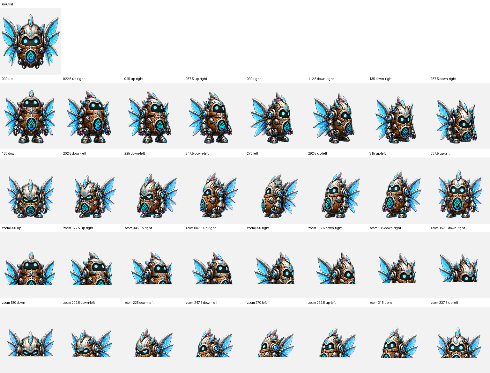

<div align="center">

# Aetherbite

**The Bio-Digital Systems Tinkerer**


*Humidity Intelligence's cinematic dimensional systems tinkerer, with crystalline wings, layered articulated armour, and expressive motion.*

[**Install Aetherbite**](https://senyo888.github.io/codex-pets/install/aetherbite/)

</div>

## Personality

Aetherbite is energetic, resolute, and inventive. It brings a compact but dimensional presence to systems work while keeping the same practical instinct: observe carefully, explain the change, and improve the smallest useful thing first.

Its silver-and-copper frame, crystalline cyan wings, dark luminous visor, and Humidity Intelligence chest crest preserve the established identity while adding clearer depth and material separation.

## Design and motion

Aetherbite now uses cinematic dimensional spritework without changing its recognizable silhouette or state semantics.

- overlapping armour plates, recessed joints, bevels, and ambient occlusion create readable front-to-back body depth;
- polished silver, aged copper, dark visor glass, and restrained cyan emission separate the materials cleanly;
- translucent faceted wings change overlap through coherent yaw and pitch parallax;
- the eyes lead each look direction while the rigid helmet, upper torso, and wings follow physically;
- directional travel retains an alternating articulated gait, while running remains focused systems work rather than literal locomotion;
- waiting, review, failure, wave, and jump states remain distinct and explainable at pet size.

## Package

| Property | Value |
| --- | --- |
| Pet id | `aetherbite` |
| Sprite contract | v2 |
| Atlas | `1536 × 2288` WebP |
| Cell size | `192 × 208` |
| Animation rows | 9 standard + 2 look-direction rows |
| SHA-256 | `18ce2adf6e4b30c42b1943cd32398757014d26c729b7f3a63e4d969abed40346` |

The package contains the exact validated spritesheet and its matching `pet.json`. No rescaling, recompression, or post-validation sprite editing was applied before publication.

## Install

Use the button above, or open this URI with the Codex desktop app:

```text
codex://pets/install?name=Aetherbite&imageUrl=https%3A%2F%2Fraw.githubusercontent.com%2Fsenyo888%2Fcodex-pets%2Fmain%2Fpets%2Faetherbite%2Fspritesheet.webp&description=Aetherbite%20is%20Humidity%20Intelligence%27s%20bio-digital%20systems%20tinkerer%2C%20shaped%20through%20cinematic%20dimensional%20spritework%20with%20crystalline%20wings%2C%20layered%20articulated%20armour%2C%20and%20expressive%20motion.&spriteVersionNumber=2
```

Then select Aetherbite in **Settings → Pets** and use `/pet` to wake or tuck it away.

## Validation

Aetherbite passed the v2 atlas validator with:

- correct `8 × 11` geometry and alpha transparency;
- no structural errors or validator warnings;
- no transparent-pixel RGB residue;
- no chroma fringe after the authoritative cleanup pass;
- all four cardinal look directions confirmed by independent blind review;
- no failed semantic direction verdicts across the complete 16-direction loop;
- reviewed intermediate-axis and continuity warnings with no visible reversal, snap, clipping, identity drift, body hole, or broken attachment.

[Read the validation summary](qa/validation-summary.json)

<details>
<summary><strong>View all animation cells</strong></summary>



</details>

<details>
<summary><strong>View the 16-direction QA sheet</strong></summary>



</details>

## Attribution

Aetherbite is created and maintained by **Senyo** and published under [CC BY 4.0](../../LICENSE). If you remix or redistribute it, retain attribution and link back to this repository.
