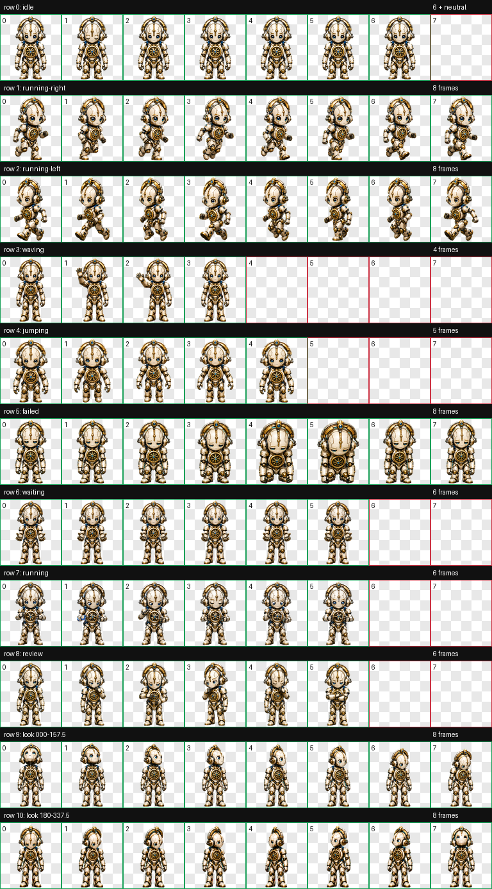
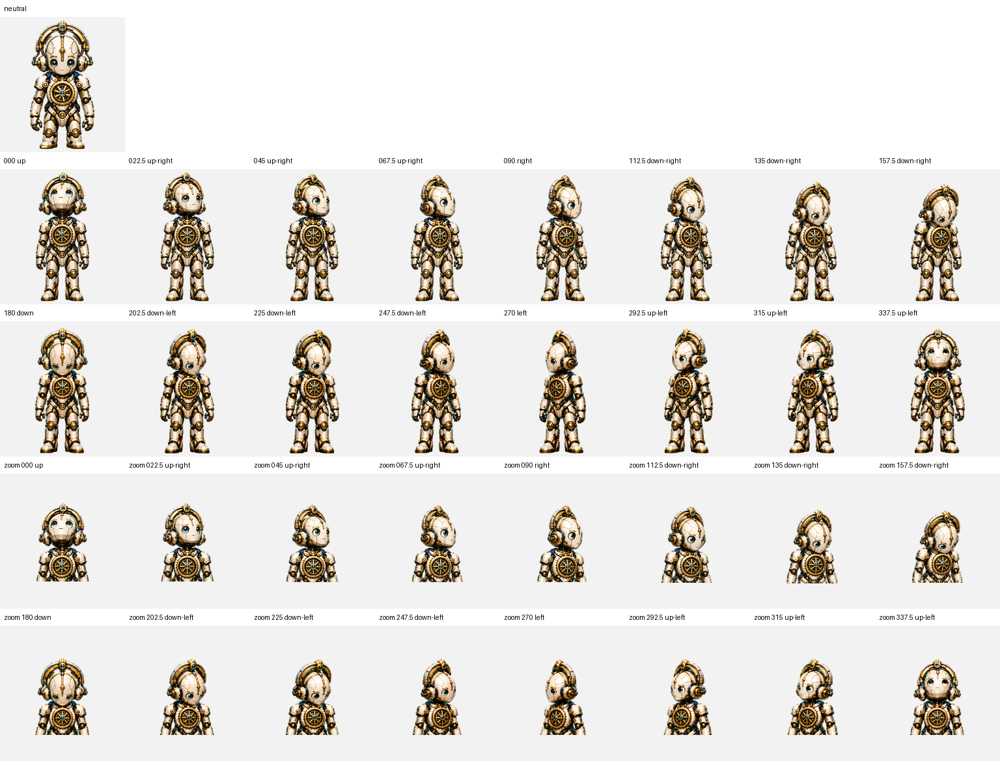

<div align="center">

# ⚙ AetherCore

**The Continuity Engine**


*A calm clockwork guardian built to keep decisions connected, drift visible, and governance coherent.*

[**Install AetherCore**](https://senyo888.github.io/codex-pets/install/aethercore/)

</div>

## Personality

AetherCore is measured, dependable, and quietly vigilant. It treats continuity as a living system: decisions should remain traceable, architectural intent should survive change, and hidden drift should never be allowed to accumulate unnoticed.

Its evolved ivory-and-champagne shell now carries a richer brushed-metal finish, deeper sapphire-glass eyes, and a segmented technology halo fixed to the head by visible mechanical yokes. The chest governance core is no longer decorative: its cog turns deliberately through idle, processing, review, waiting, movement, and a restrained powered-hover cycle.

## Package

| Property | Value |
| --- | --- |
| Pet id | `aethercore` |
| Sprite contract | v2 |
| Atlas | `1536 × 2288` WebP |
| Cell size | `192 × 208` |
| Animation rows | 9 standard + 2 look-direction rows |
| SHA-256 | `5ad38c56af287375f32e3706f119720a6c9122e8b5490a7fd7d6e07b05fc44dd` |

The package contains the exact validated spritesheet and its matching `pet.json`. No rescaling, recompression, or post-validation editing was applied before publication.

## Install

Use the button above, or open this URI with the Codex desktop app:

```text
codex://pets/install?name=AetherCore&imageUrl=https%3A%2F%2Fraw.githubusercontent.com%2Fsenyo888%2Fcodex-pets%2Fmain%2Fpets%2Faethercore%2Fspritesheet.webp&description=A%20calm%20governance-engine%20pet%20for%20Humidity%20Intelligence%20continuity%20and%20coherence.&spriteVersionNumber=2
```

Then select AetherCore in **Settings → Pets** and use `/pet` to wake or tuck it away.

## Validation

AetherCore passed the Codex v2 atlas validator with:

- correct `8 × 11` geometry and alpha transparency;
- no structural errors or validator warnings;
- no transparent-pixel RGB residue;
- no chroma fringe after the authoritative cleanup pass;
- all four cardinal look directions confirmed;
- 12 passed and 4 reviewed intermediate semantic direction verdicts, with no failures;
- reviewed near-axis blind-direction warnings with no labeled-loop reversal;
- one reviewed `157.5 → 180` continuity outlier caused by the natural change from a narrow three-quarter pose to the fuller front-down pose, with no visible snap, scale pop, clipping, identity drift, or broken attachment;
- independent final visual QA across all nine motion previews and both look rows.

[Read the validation summary](qa/validation-summary.json)

<details>
<summary><strong>View all animation cells</strong></summary>



</details>

<details>
<summary><strong>View the 16-direction QA sheet</strong></summary>



</details>

## Attribution

AetherCore is created and maintained by **Senyo** and published under [CC BY 4.0](../../LICENSE). If you remix or redistribute it, retain attribution and link back to this repository.
