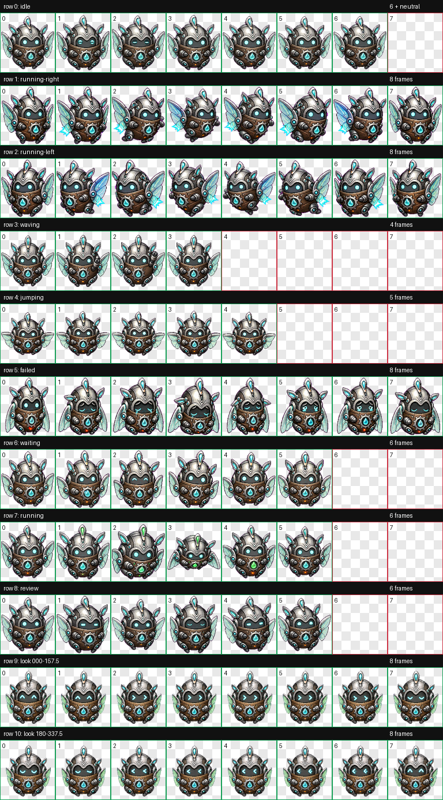
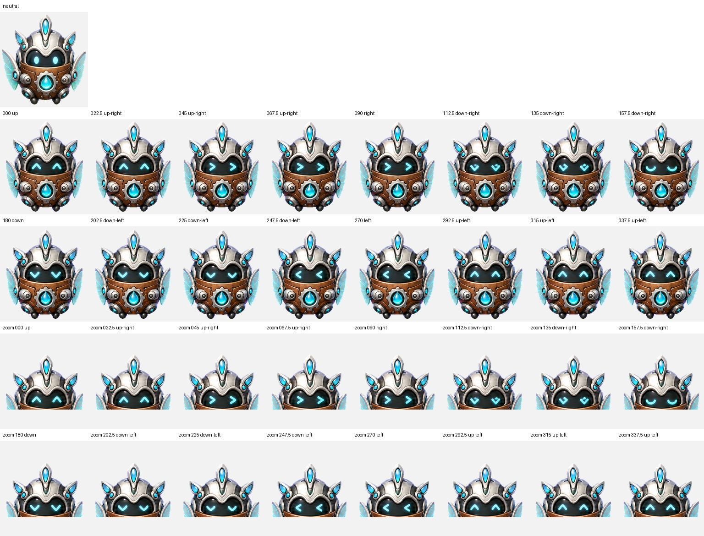

<div align="center">

# AetherMite

**The Systems Tinkerer**


*A premium dimensional Humidity Intelligence champion with a layered mechanical shell and luminous environmental core.*

[**Install AetherMite**](https://senyo888.github.io/codex-pets/install/aethermite/)

</div>

## Personality

AetherMite is curious, energetic, and inventive. It notices tiny inconsistencies, explores practical refinements, and prefers small explainable improvements over clever but fragile shortcuts.

Its compact bronze-and-silver shell carries a bright environmental core: a small systems companion with a sharp eye for diagnostics, tooling, and polish.

## Design

AetherMite is rebuilt with polished dimensional spritework while retaining its compact silhouette, bronze-and-silver palette, cyan optics, and environmental identity. Layered armour plates, recessed seams, articulated joints, convex glass lenses, and controlled material highlights give the shell real depth instead of a flat illustrated finish.

The animation set uses deliberate perspective shifts, grounded contact shadows, shell overlap, and readable mechanical posing. The result is more dimensional in motion while preserving the same deterministic v2 state and direction contract.

## Package

| Property | Value |
| --- | --- |
| Pet id | `aethermite` |
| Sprite contract | v2 |
| Atlas | `1536 × 2288` WebP |
| Cell size | `192 × 208` |
| Animation rows | 9 standard + 2 look-direction rows |
| SHA-256 | `13869434db6f58f07c0d2571def9d8da624bc77416adc4964727084d23840384` |

The package contains the exact validated spritesheet and matching sanitized metadata. No rescaling, recompression, or post-validation sprite editing was applied before publication.

## Install

Use the button above, or open this URI with the Codex desktop app:

```text
codex://pets/install?name=AetherMite&imageUrl=https%3A%2F%2Fraw.githubusercontent.com%2Fsenyo888%2Fcodex-pets%2Fmain%2Fpets%2Faethermite%2Fspritesheet.webp&description=A%20premium%20dimensional%20bio-digital%20systems%20champion%20for%20Humidity%20Intelligence%2C%20with%20a%20layered%20bronze-and-silver%20shell%20and%20luminous%20environmental%20core.&spriteVersionNumber=2
```

Then select AetherMite in **Settings → Pets** and use `/pet` to wake or tuck it away.

## Validation

AetherMite passed the v2 atlas validator with:

- correct `8 × 11` geometry and alpha transparency;
- no structural errors or validator warnings;
- no transparent-pixel RGB residue;
- all four cardinal look directions confirmed;
- no failed semantic direction verdicts;
- reviewed intermediate-direction and continuity warnings with no visible reversal, clipping, identity drift, or broken attachment;
- preview regenerated directly from the submitted atlas at `384 × 416`.

[Read the validation summary](qa/validation-summary.json)

<details>
<summary><strong>View all animation cells</strong></summary>



</details>

<details>
<summary><strong>View the 16-direction QA sheet</strong></summary>



</details>

## Attribution

AetherMite is created and maintained by **Senyo** and published under [CC BY 4.0](../../LICENSE). If you remix or redistribute it, retain attribution and link back to this repository.
