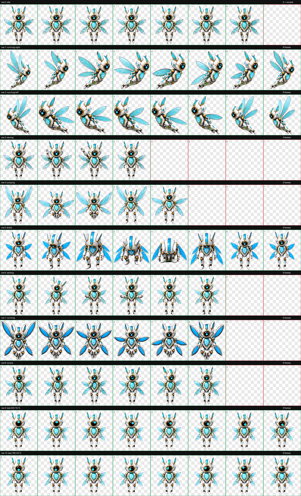
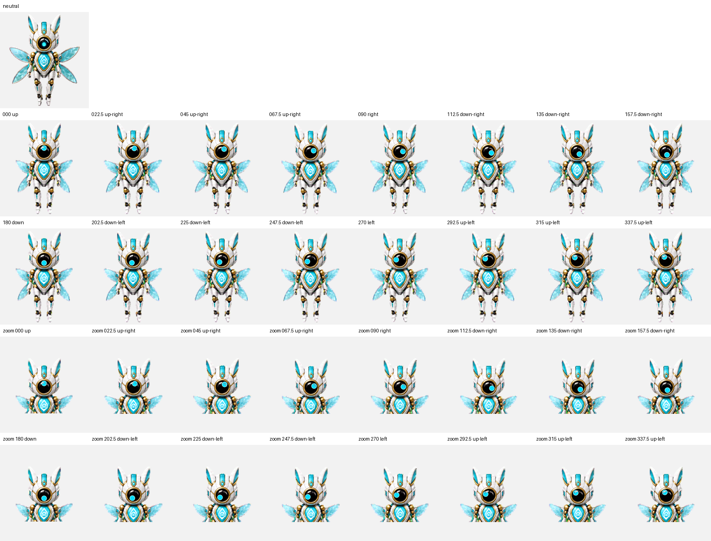

<div align="center">

# AetherWing

**Pet 002 · The Runtime Sentinel**


*A flight-first guardian of deterministic control, architectural discipline, and truth-backed runtime behaviour.*

[**Install AetherWing**](https://senyo888.github.io/codex-pets/install/aetherwing/)

</div>

## Personality

AetherWing watches the boundary between intent and execution. She challenges weakened architecture, detects drift early, and protects deterministic behaviour without disrupting stable systems.

Her approach is measured and sceptical. She values clean tests, explicit reasoning, and dashboard semantics that stay anchored to runtime truth.

## Design

AetherWing uses sharp premium dimensional spritework while retaining her original white, cyan, gold, black, and dark-navy palette. Her polished metallic and ceramic-metal shell is paired with a convex smoked-glass eye and a glass chest badge carrying the official [Humidity Intelligence](https://github.com/senyo888/humidity-intelligence) glyph.

Four modern articulated wings make flight her chosen form of movement. Directional travel uses visible raised, mid, lowered, and recovery flap positions, while her improved mechanical legs articulate into an aerodynamic rearward posture rather than walking or running on the ground.

## Package

| Property | Value |
| --- | --- |
| Pet id | `aetherwing` |
| Sprite contract | v2 |
| Atlas | `1536 × 2288` WebP |
| Cell size | `192 × 208` |
| Animation rows | 9 standard + 2 look-direction rows |
| SHA-256 | `c5b03756e270516b8200b75cef811e094f768638633273eadc3ce0c6fa5002fa` |

The package contains the exact validated spritesheet and matching sanitized metadata. No rescaling, recompression, or post-validation sprite editing was applied before publication.

## Install

Use the button above, or open this URI with the Codex desktop app:

```text
codex://pets/install?name=AetherWing&imageUrl=https%3A%2F%2Fraw.githubusercontent.com%2Fsenyo888%2Fcodex-pets%2Fmain%2Fpets%2Faetherwing%2Fspritesheet.webp&description=A%20calm%20guardian%20companion%20for%20Humidity%20Intelligence%2C%20protecting%20deterministic%20runtime%20control%2C%20architectural%20discipline%2C%20and%20truth-backed%20dashboard%20behaviour.&spriteVersionNumber=2
```

Then select AetherWing in **Settings → Pets** and use `/pet` to wake or tuck her away.

## Validation

AetherWing passed the v2 atlas validator with:

- correct `8 × 11` geometry and alpha transparency;
- zero structural errors, validator warnings, or transparent-pixel RGB residue;
- all 16 look directions passing their intended positions;
- all 28 blind direction classifications unanimously correct;
- coherent identity, scale, glass, wing, leg, and chest-badge details across the animation set;
- flight-first right/left travel with visible wing-flap cycles and no ground locomotion.

[Read the validation summary](qa/validation-summary.json)

<details>
<summary><strong>View all animation cells</strong></summary>



</details>

<details>
<summary><strong>View the 16-direction QA sheet</strong></summary>



</details>

## Attribution

AetherWing is created and maintained by **Senyo** and published under [CC BY 4.0](../../LICENSE). If you remix or redistribute her, retain attribution and link back to this repository.
