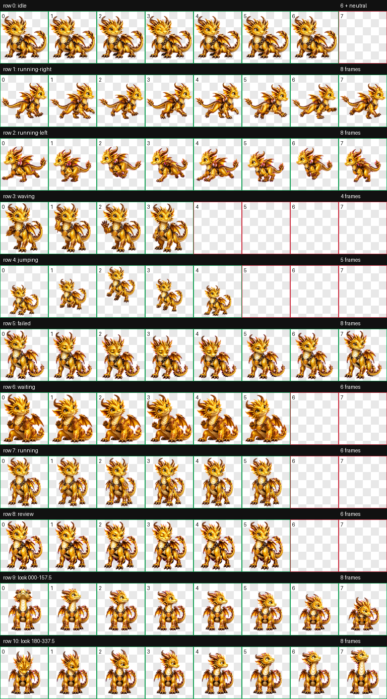
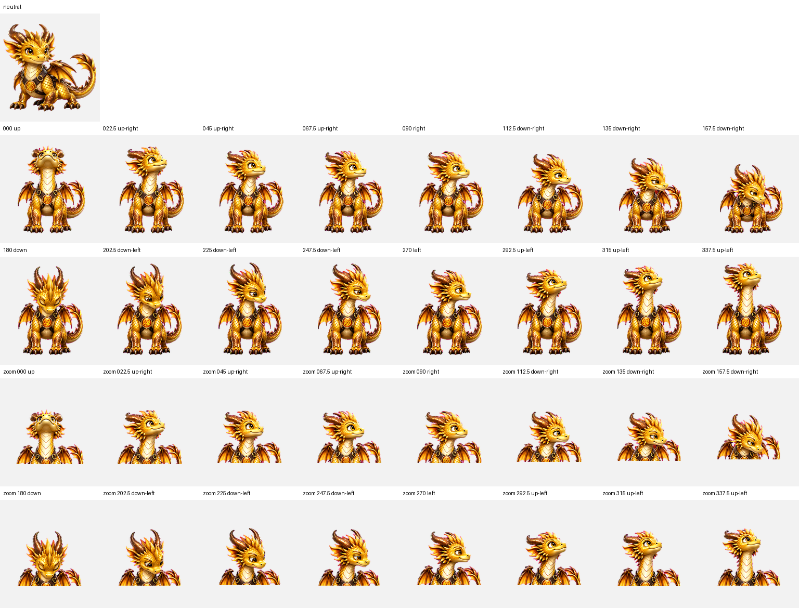

<div align="center">

# Áureo

**Golden quest companion**


*A loyal, watchful and curious golden dragon with a dark leather harness and an amber chest gem.*

[**Install Áureo**](https://senyo888.github.io/codex-pets/install/aureo/)

</div>

[View the static idle preview](preview.png)

## Personality

Áureo is a warm, attentive fantasy dragon companion, with wingbeats, tail sways,
small head turns and alert changes in posture. His golden scales, harness, chest
emblem and smaller jumping poses are preserved from the contributor's original design.

## Package

| Property | Value |
| --- | --- |
| Pet id | `aureo` |
| Sprite contract | v2 |
| Atlas | `1536 × 2288` WebP |
| Cell size | `192 × 208` |
| Animation rows | 9 standard + 2 look-direction rows |
| SHA-256 | `614dabf05306723f15415b2ae7ecae47ba4e9437ffd5083a437303f763e67098` |

The atlas and manifest are byte-for-byte copies of the submission. No recolouring,
rescaling, recompression, frame remapping or emblem edits were applied. Package and
site previews use the repository's 6.6-second idle renderer and matching static PNG;
those presentation derivatives do not change the runtime artwork.

## Install

Use the installer above, or open this URI with the Codex desktop app:

```text
codex://pets/install?name=%C3%81ureo&imageUrl=https%3A%2F%2Fraw.githubusercontent.com%2Fsenyo888%2Fcodex-pets%2Fmain%2Fpets%2Faureo%2Fspritesheet.webp&description=Drag%C3%B3n%20dorado%20con%20arn%C3%A9s%20de%20cuero%20y%20gema%20pectoral%20con%20el%20s%C3%ADmbolo%20de%20OpenAI.&spriteVersionNumber=2
```

Then select Áureo in **Settings → Pets** and wake him with `/pet`.

## Validation

**Reviewed with known limitations.** The maintainer accepted the original design.
Strict validation is not recorded as a pass. A [maintainer exception](../../docs/VALIDATION_EXCEPTIONS.md#aureo-008)
accepts the known chroma and left-look limitations for this exact unchanged atlas.

- The atlas has correct v2 geometry and alpha transparency; all 74 used cells are
  populated and all 14 unused cells are transparent. Transparent RGB residue is zero.
- Both QA sheets exactly match derivatives regenerated from the submitted WebP.
- The 270° screen-left look frame faces right, as do several other left-sector poses.
  Up, right and down pass visual cardinal review; screen-left does not. The sixteen
  look cells are present, but pointer-facing behavior has this known limitation.
- Strict chroma checks report 11 partially transparent green edge pixels in eight
  cells. Their count does not establish a noticeable native-size defect.
- Jump size and look-loop continuity differences are retained as submitted. Native
  app activation and pointer behavior have not been tested for this package.

[Validation summary](qa/validation-summary.json) · [Strict atlas results](qa/atlas-validation.json)

<details>
<summary><strong>View all animation cells</strong></summary>



</details>

<details>
<summary><strong>View the 16-direction QA sheet</strong></summary>



</details>

## Attribution

Artwork and animation by [@0MartinSmith0](https://github.com/0MartinSmith0), generated
for this pet with OpenAI ImageGen and contributed under [CC BY 4.0](../../LICENSE).
[Original submission and rights affirmation](https://github.com/senyo888/codex-pets/issues/24).
Maintainer additions cover packaging, preview timing, documentation and QA evidence;
the original atlas and manifest are unchanged. Retain this attribution when sharing.

The chest emblem belongs to the submitted character design. This independent community
package is not affiliated with or endorsed by OpenAI. The contribution's CC BY 4.0
statement is not a representation of third-party trademark permission.
