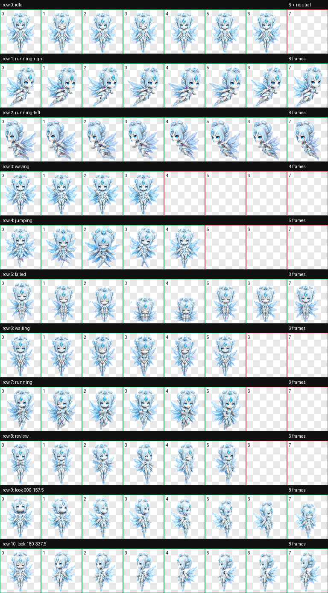
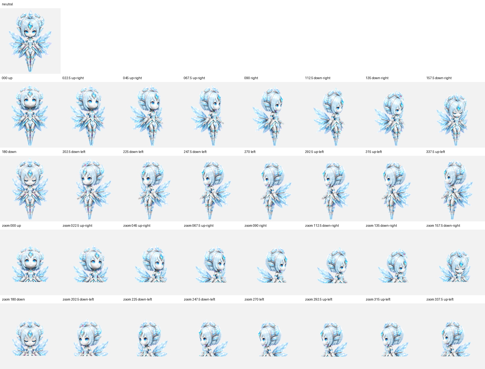

<div align="center">

# ✦ Bella

**The 1 True Source**


*A premium CGI crystalline coherence guardian with layered depth, graceful flight, and a precise eye for truth.*

[**Install Bella**](https://senyo888.github.io/codex-pets/install/bella/)

</div>

## Personality

Bella is composed, precise, and gently sceptical. She prefers truth over theatre, deterministic systems over hidden magic, and a clean review over an enthusiastic guess.

## Design and motion

Bella preserves her recognizable porcelain face, luminous cyan eyes, forehead diamond, crown crystals, and six-wing silhouette while moving from flat outlined art to a modern CGI 3D construction.

- softly bevelled translucent crystal establishes front, middle, and rear wing planes;
- satin-white ceramic facial material and brushed-silver trims add readable depth;
- layered couture-like armour and skirt crystals replace flat painted clothing;
- dimensional eyelids, brows, lighting, occlusion, and foreshortening carry her expressions;
- directional travel remains a graceful airborne glide rather than foot-running;
- her jump row now performs a poised five-frame airborne curtsy.

The remaining standard states retain Bella's established movement language, and all 16 look directions preserve her original clockwise choreography with physical eye, head, wing, and clothing perspective.

## Package

| Property | Value |
| --- | --- |
| Pet id | `bella` |
| Sprite contract | v2 |
| Atlas | `1536 × 2288` WebP |
| Cell size | `192 × 208` |
| Animation rows | 9 standard + 2 look-direction rows |
| SHA-256 | `548cb72d381fcc861f5017f0213c3d794ce2210d4b9781a58ee53331aa43344d` |

The package contains the exact validated spritesheet and its matching `pet.json`. No rescaling, recompression, or post-validation editing was applied before publication.

## Install

Use the button above, or open this URI with the Codex desktop app:

```text
codex://pets/install?name=Bella&imageUrl=https%3A%2F%2Fraw.githubusercontent.com%2Fsenyo888%2Fcodex-pets%2Fmain%2Fpets%2Fbella%2Fspritesheet.webp&description=The%201%20True%20Source%2C%20a%20calm%20crystalline%20CGI%20coherence%20guardian%20who%20restores%20deterministic%20harmony.&spriteVersionNumber=2
```

Then select Bella in **Settings → Pets** and use `/pet` to wake or tuck her away.

## Validation

Bella passed the Codex v2 atlas validator with:

- correct `8 × 11` geometry and alpha transparency;
- no structural errors or validator warnings;
- no transparent-pixel RGB residue;
- no chroma fringe after the authoritative cleanup pass;
- all four cardinal look directions confirmed by independent blind review;
- no failed semantic direction verdicts across the complete 16-direction loop;
- original movement preserved outside the intentional glide and curtsy refinements;
- reviewed intermediate-axis and continuity warnings with no visible reversal, snap, clipping, identity drift, or broken attachment.

[Read the validation summary](qa/validation-summary.json)

<details>
<summary><strong>View all animation cells</strong></summary>



</details>

<details>
<summary><strong>View the 16-direction QA sheet</strong></summary>



</details>

## Attribution

Bella is created and maintained by **Senyo** and published under [CC BY 4.0](../../LICENSE). If you remix or redistribute her, retain attribution and link back to this repository.
