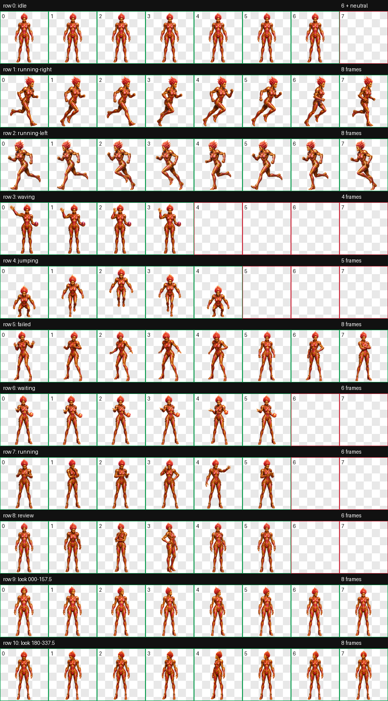
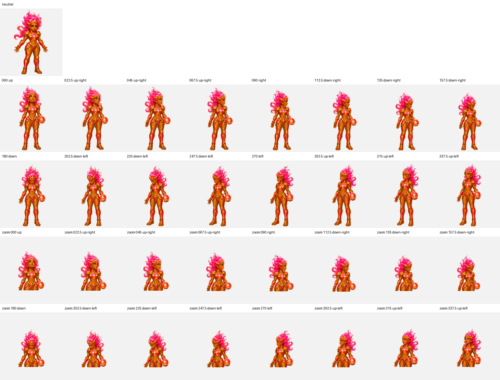

<div align="center">

# Calian

**The Tactical Sentinel**


*A composed tactical guardian and one half of a sister act of unmatched diligence, known for calm judgement, deliberate control, and exact follow-through.*

[**Install Calian**](https://senyo888.github.io/codex-pets/install/calian/)

</div>

## Personality

Calian is calm, tactical, and steady under pressure. She isolates the decisive fault, establishes a clear plan, and restores control with measured action.

Her strength is disciplined diagnosis: she separates signal from noise, acts with purpose, and verifies the result before moving on.

## The sister act

Calian and [Scarlet](../scarlet/README.md) work as a coordinated pair. Calian isolates decisive faults and restores deliberate control; Scarlet carries every correction through to verified closure. Together, they are a sister act of unmatched diligence.

## Interaction contract

- A poke triggers one deliberate four-frame wave rather than a rapid oscillation.
- The orb appears only during the poked wave or when Calian needs attention, attached to her left palm.
- Idle, movement, jump, failure, active-processing, review, and look-direction states remain orb-free.

## Package

| Property | Value |
| --- | --- |
| Pet id | `calian` |
| Sprite contract | v2 |
| Atlas | `1536 × 2288` WebP |
| Cell size | `192 × 208` |
| Animation rows | 9 standard + 2 look-direction rows |
| SHA-256 | `4b9ac6125a4222a5e2391ba04ee3bf0a0b6c2fcd98aa07c8f2b2322dd614933b` |

The package contains the exact validated spritesheet and matching sanitized metadata. No rescaling, recompression, or post-validation sprite editing was applied before publication.

## Install

Use the button above, or open this URI with the Codex desktop app:

```text
codex://pets/install?name=Calian&imageUrl=https%3A%2F%2Fraw.githubusercontent.com%2Fsenyo888%2Fcodex-pets%2Fmain%2Fpets%2Fcalian%2Fspritesheet.webp&description=One%20half%20of%20a%20sister%20act%20of%20unmatched%20diligence%2C%20Calian%20is%20a%20calm%20tactical%20guardian%20who%20isolates%20decisive%20faults%20and%20restores%20deliberate%20control.&spriteVersionNumber=2
```

Then select Calian in **Settings → Pets** and use `/pet` to wake or tuck her away.

## Validation

Calian passed the v2 atlas validator with:

- correct `8 × 11` geometry and alpha transparency;
- no structural errors or validator warnings;
- no transparent-pixel RGB residue;
- all four cardinal look directions confirmed;
- no failed semantic direction verdicts;
- three reviewed intermediate-direction warnings with no visible reversal, clipping, identity drift, or broken attachment;
- a consistent adult CGI identity, compact hair, and proportional non-bulky legs across all standard and look-direction cells.

[Read the validation summary](qa/validation-summary.json)

<details>
<summary><strong>View all animation cells</strong></summary>



</details>

<details>
<summary><strong>View the 16-direction QA sheet</strong></summary>



</details>

## Attribution

Calian is created and maintained by **Senyo** and published under [CC BY 4.0](../../LICENSE). If you remix or redistribute her, retain attribution and link back to this repository.
