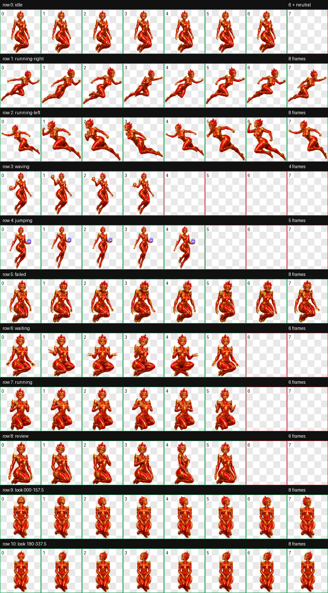
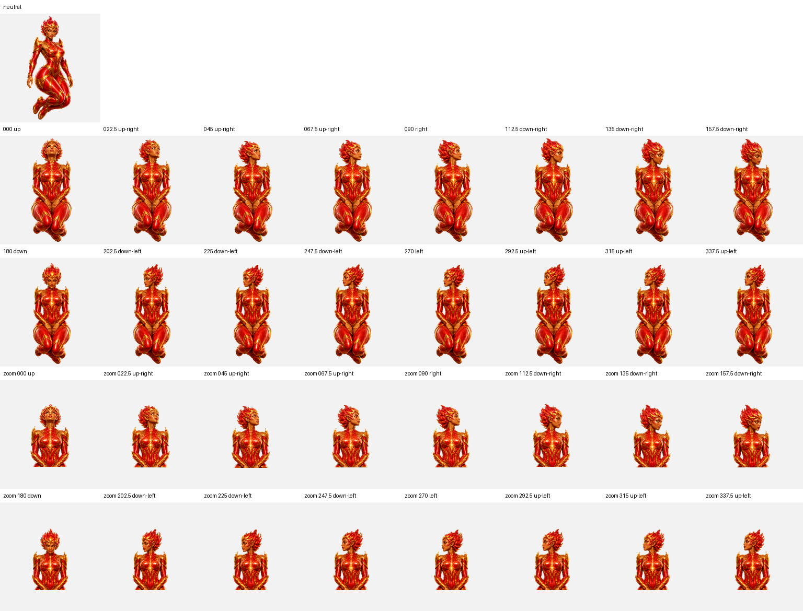

<div align="center">

# Scarlet

**The Propulsive Execution Guardian**


*A poised CGI guardian and one half of a sister act of unmatched diligence, built to trace drift and carry every correction to verified closure.*

[**Install Scarlet**](https://senyo888.github.io/codex-pets/install/scarlet/)

</div>

## Personality

Scarlet is poised, vigilant, and exacting. She follows weak signals across the full execution path, contains drift before it spreads, and closes gaps with controlled precision.

Her premium CGI identity combines a readable sculpted face, short flame-crown hair, layered scarlet-and-gold armour, and a compact silhouette that remains clear at native pet size. Directional movement is true propulsive flight rather than walking or air-running.

## The sister act

[Calian](../calian/README.md) and Scarlet work as a coordinated pair. Calian isolates decisive faults and restores deliberate control; Scarlet carries every correction through to verified closure. Together, they are a sister act of unmatched diligence.

## Interaction contract

- Directional travel is propulsive flight with both feet airborne and no ground-running cadence.
- The orb appears exactly once in the waving and jumping interactions, attached to one palm.
- Idle, travel, failure, waiting, processing, review, and all look-direction states remain orb-free.
- The 16 look directions preserve a stable body anchor while the eyes, head, and neck carry the gaze.

## Package

| Property | Value |
| --- | --- |
| Pet id | `scarlet` |
| Sprite contract | v2 |
| Atlas | `1536 × 2288` WebP |
| Cell size | `192 × 208` |
| Animation rows | 9 standard + 2 look-direction rows |
| SHA-256 | `f94405dc13396f703b600f4462342d5928ec7716461c86ad96551fec63b54840` |

The package contains the exact validated spritesheet and matching sanitized metadata. No rescaling, recompression, or post-validation sprite editing was applied before publication.

## Install

Use the button above, or open this URI with the Codex desktop app:

```text
codex://pets/install?name=Scarlet&imageUrl=https%3A%2F%2Fraw.githubusercontent.com%2Fsenyo888%2Fcodex-pets%2Fmain%2Fpets%2Fscarlet%2Fspritesheet.webp&description=One%20half%20of%20a%20sister%20act%20of%20unmatched%20diligence%2C%20Scarlet%20is%20a%20poised%20CGI%20guardian%20who%20traces%20drift%2C%20protects%20execution%20integrity%2C%20and%20drives%20every%20correction%20to%20verified%20closure.&spriteVersionNumber=2
```

Then select Scarlet in **Settings → Pets** and use `/pet` to wake or tuck her away.

## Validation

Scarlet passed the v2 atlas validator with:

- correct `8 × 11` geometry and alpha transparency;
- no structural errors or validator warnings;
- no transparent-pixel RGB residue;
- all four cardinal look directions confirmed;
- no failed semantic direction verdicts;
- five reviewed intermediate-direction warnings with no wrong quadrant or loop reversal;
- propulsive left/right flight and the two-state orb contract confirmed at native size;
- final independent visual QA passed with no blockers.

[Read the validation summary](qa/validation-summary.json)

<details>
<summary><strong>View all animation cells</strong></summary>



</details>

<details>
<summary><strong>View the 16-direction QA sheet</strong></summary>



</details>

## Attribution

Scarlet is created and maintained by **Senyo** and published under [CC BY 4.0](../../LICENSE). If you remix or redistribute her, retain attribution and link back to this repository.
